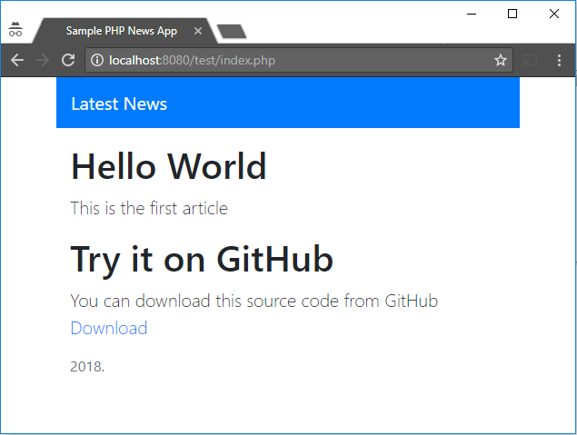

# php-sample-news
A small sample PHP code that retrieves some news from SQL. Easy to use as a sample app during learning cloud solutions.

Never use in production, this a sample code only.

# How to use

 1. Create a MySQL database with a name: "php_news"
 2. Edit the config.php file: servername, username, password, database name.
 3. Import create.sql to MySQL
 4. Run index.php

